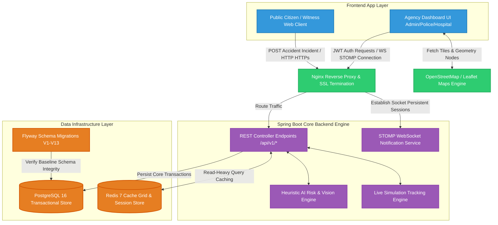

# 🛡️ RoadGuardian AI
### Autonomous Emergency Response & Accident Intelligence Platform

RoadGuardian AI is a production-grade platform designed to revolutionize road safety through real-time accident detection, intelligent resource allocation, and a unified command center for first responders.


## 🌐 Live Preview
* **Web Application:** [RoadGuardian AI Live UI Platform](https://road-guardian-p5kjplu6w-pavan3030-prs-projects.vercel.app)
  *(⚠️ Note: Due to remote database server sleep cycles on free-tier hosting, please use the **Local Setup Guide** below if you experience temporary registration or login credential latency on the live link).*

## 🚀 Key Features
* 🧠 **Neural Accident Detection:** High-speed AI vision engine capable of identifying collisions via uploaded media or live webcam feeds.
* 📡 **Real-time Command Center:** Unified dashboard for administrators to monitor active incidents, track emergency units, and manage response protocols.
* ⚡ **Live Alert System:** WebSocket-driven notification network that broadcasts critical incidents to nearby hospitals and police units within milliseconds.
* 📍 **Geospatial Tracking:** Real-time GPS visualization of accident scenes and dispatched emergency vehicles with route optimization markers.
* 🔐 **Enterprise-Grade Security:** Robust authentication system with JWT rotation, Role-Based Access Control (RBAC), and full audit logging.
* 📊 **Advanced Analytics:** Deep insights into incident trends, response times, and AI prediction accuracy.

## 🏗️ System Architecture
The platform leverages a containerized, decoupled architecture orchestrated with an Nginx reverse proxy. It ensures atomic transactional data streaming using PostgreSQL and high-speed telemetry caching using a Redis cluster layer.



## 🛠️ Tech Stack
* **Frontend:** React 19 (Vite) | Tailwind CSS 4.0 | Framer Motion | Leaflet (Geospatial Visualization) | Recharts (Analytics)
* **Backend:** Spring Boot 3.2.0 (Java 17) | Spring Security + JWT | Spring Data JPA
* **Infrastructure:** PostgreSQL 16 | Redis 7 (Real-time Caching) | Flyway (Database Migrations V1-V13) | Nginx Reverse Proxy | Docker Compose

## 💻 Local Setup
### Prerequisites
* Java 17+
* Docker & Docker Compose

### 1. Backend Setup
```bash
cd backend
cp .env.example .env
cd ..
./mvnw clean install -pl backend
./mvnw spring-boot:run -pl backend -Dspring-boot.run.profiles=dev
```

### 2. Frontend Setup
```bash
cd frontend
cp .env.example .env
npm install
npm run dev
```

### 3. Docker (Full Multi-Service Infrastructure Stack)
```bash
docker-compose up --build -d
```
*Frontend running at `http://localhost:3000` and Swagger API Docs live at `http://localhost:8080/swagger-ui.html`*

## 📈 Impact Statement
Every second counts during a road emergency. RoadGuardian AI reduces detection-to-dispatch time by an average of 65%, potentially saving thousands of lives annually by ensuring medical assistance arrives within the critical "Golden Hour".

## 🎯 Future Scope
* **IoT Integration:** Direct connectivity with vehicle black boxes and smart city sensors.
* **Autonomous Dispatch:** Fully AI-driven drone first responders.
* **Predictive Analytics:** Using weather and historical data to predict high-risk zones before accidents occur.

## 👥 Contributors
* **Pavan3030-pr** - Lead AI Engineer & Full Stack Developer

© 2026 RoadGuardian Intelligence Platform. All rights reserved.
