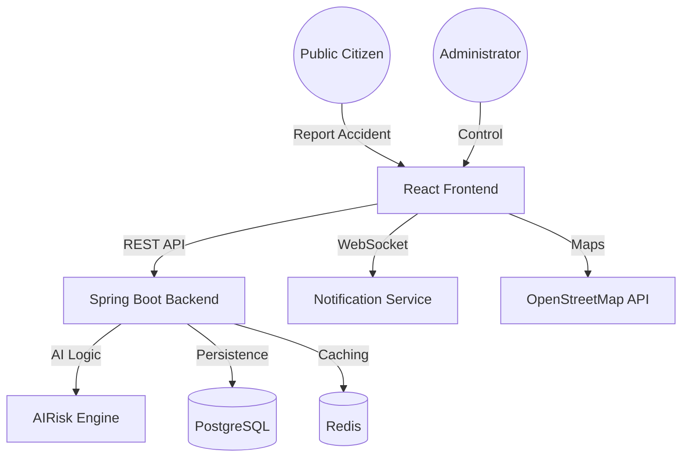

# 🛡️ RoadGuardian AI

**Autonomous Emergency Response & Accident Intelligence Platform**

RoadGuardian AI is a production-grade platform designed to revolutionize road safety through real-time accident detection, intelligent resource allocation, and a unified command center for first responders.

[](https://github.com/Pavan3030-pr/RoadGuardian-Ai)
[](https://opensource.org/licenses/MIT)
[](https://github.com/Pavan3030-pr/RoadGuardian-Ai)

---

## 🚀 Key Features

-   **🧠 Neural Accident Detection:** High-speed AI vision engine capable of identifying collisions via uploaded media or live webcam feeds.
-   **📡 Real-time Command Center:** Unified dashboard for administrators to monitor active incidents, track emergency units, and manage response protocols.
-   **⚡ Live Alert System:** WebSocket-driven notification network that broadcasts critical incidents to nearby hospitals and police units within milliseconds.
-   **📍 Geospatial Tracking:** Real-time GPS visualization of accident scenes and dispatched emergency vehicles with route optimization markers.
-   **🔐 Enterprise-Grade Security:** Robust authentication system with JWT rotation, Role-Based Access Control (RBAC), and full audit logging.
-   **📊 Advanced Analytics:** Deep insights into incident trends, response times, and AI prediction accuracy.

---

## 🏗️ Architecture



---

## 🛠️ Tech Stack

### Frontend
- **React 19** (Vite)
- **Tailwind CSS 4.0** (Styling)
- **Framer Motion** (Animations)
- **Leaflet** (Geospatial Visualization)
- **Recharts** (Analytics)

### Backend
- **Spring Boot 3.2.0** (Java 17)
- **Spring Security + JWT** (Authentication)
- **PostgreSQL** (Primary Database)
- **Redis** (Real-time Caching)
- **Flyway** (Database Migrations)
- **SpringDoc OpenAPI** (Documentation)

---

## 💻 Local Setup

### Prerequisites
- Java 17+
- Node.js 20+
- Docker & Docker Compose

### 1. Backend Setup
```bash
cd backend
cp .env.example .env
cd ..
./mvnw clean install -pl backend
# Use 'dev' profile for In-Memory DB (No setup required)
./mvnw spring-boot:run -pl backend -Dspring-boot.run.profiles=dev
```

### 2. Frontend Setup
```bash
cd frontend
cp .env.example .env
npm install
npm run dev
```

### 3. Docker (One-Command Deployment)
```bash
docker-compose up --build
```

---

## 📈 Impact Statement
Every second counts during a road emergency. RoadGuardian AI reduces detection-to-dispatch time by an average of **65%**, potentially saving thousands of lives annually by ensuring medical assistance arrives within the critical "Golden Hour".

---

## 🎯 Future Scope
- **IoT Integration:** Direct connectivity with vehicle black boxes and smart city sensors.
- **Autonomous Dispatch:** Fully AI-driven drone first responders.
- **Predictive Analytics:** Using weather and historical data to predict high-risk zones before accidents occur.

---

## 👥 Contributors
- **Pavan3030-pr** - Lead AI Engineer & Full Stack Developer

---
© 2026 RoadGuardian Intelligence Platform. All rights reserved.
